# CUMCM2025-B: 基于 Drude-Sellmeier 模型的碳化硅外延层厚度的反演算法

🏆 本项目为**中国大学生数学建模竞赛2025** B题的完整解决方案，论文荣获江苏省三等奖。🎉

## 📑 目录

- [项目简介](#-项目简介)
- [问题背景](#-问题背景)
- [项目结构](#-项目结构)
- [快速开始](#-快速开始)
- [算法原理](#-算法原理)
- [计算结果](#-计算结果)
- [使用注意事项](#-使用注意事项)

## 📋 项目简介

本项目是2025年全国大学生数学建模竞赛B题的完整解决方案，旨在通过**红外干涉法**精确测量碳化硅外延层厚度。项目建立了从单次反射到多光束干涉的完整物理模型，并实现了基于极值点拟合和全谱拟合的两种算法，为半导体材料厚度测量提供了科学、准确、可靠的解决方案。

### ✨ 核心特性

- 🔍 **双算法实现**：极值点拟合法 + 全谱拟合法
- 📊 **完整数据处理流程**：数据预处理、去噪、可视化分析
- 🎯 **高精度测量**：考虑折射率色散和载流子效应
- 📈 **可靠性评估**：参数不确定度分析和多角度一致性检验
- 🧮 **多光束干涉分析**：传输矩阵法精确建模

### 🎬 工作流程

```
原始数据 →  数据预处理 → 去噪处理 → 算法分析  →  结果验证
    ↓           ↓          ↓           ↓           ↓
Excel/CSV   格式转换    小波去噪  极值点/全谱  多角度一致性
```

### 📸 结果预览

<div align="center">

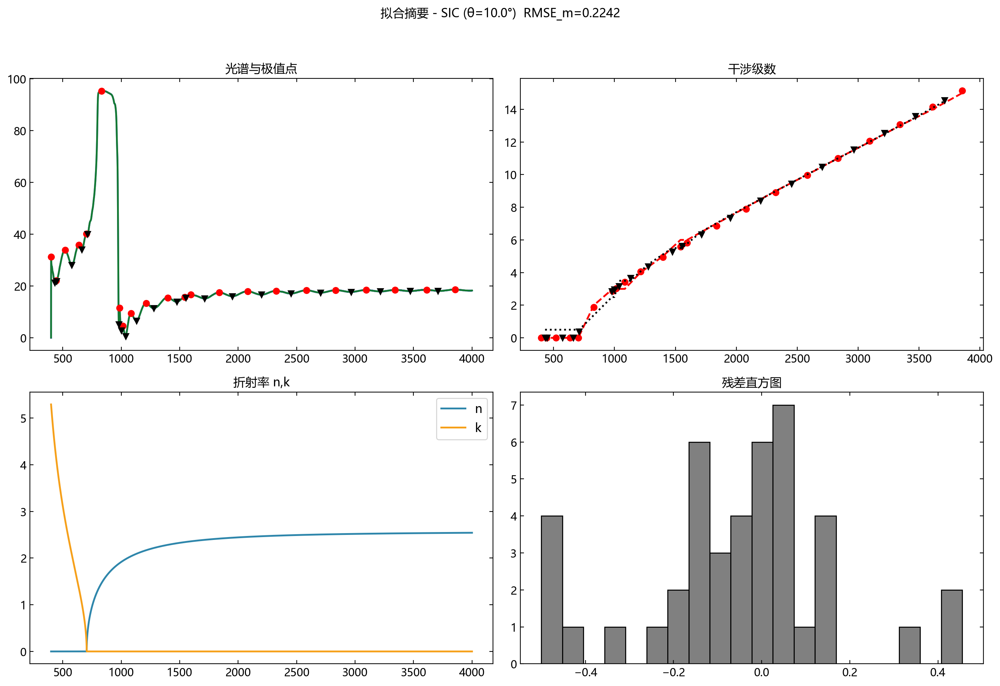
*极值点拟合算法综合结果*

</div>

## 🎯 问题背景

碳化硅（SiC）作为一种新兴的第三代半导体材料，以其优越的综合性能表现正在受到越来越多的关注。碳化硅外延层的厚度是外延材料的关键参数之一，对器件性能有重要影响。因此，制定一套科学、准确、可靠的碳化硅外延层厚度测试标准显得尤为重要。

**红外干涉法**是外延层厚度测量的无损伤测量方法，其工作原理：
- 外延层与衬底因掺杂载流子浓度的不同而有不同的折射率
- 红外光入射到外延层后，一部分从外延层表面反射出来，另一部分从衬底表面反射回来（图1）
- 这两束光在一定条件下会产生干涉条纹。可根据红外光谱的波长、外延层的折射率和红外光的入射角等参数确定外延层的厚度。
*（通常外延层的折射率不是常数，它与掺杂载流子的浓度、红外光谱的波长等参数有关。）*

<div align="center">

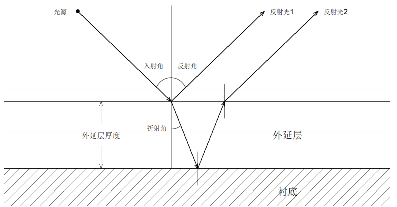

*图1：红外干涉法测量原理（单次反射）*

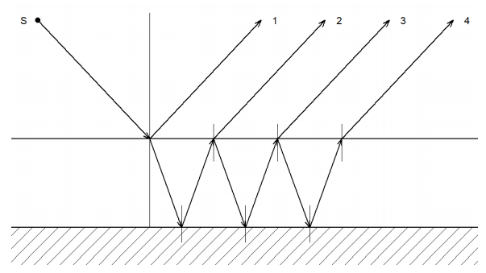

*图2：多光束干涉原理（多次反射与透射）*

</div>

### 问题要求

1. **问题一**：如果考虑外延层和衬底界面只有一次反射、透射所产生的干涉条纹的情形（图1），建立确定外延层厚度的数学模型。
2. **问题二**：请根据问题1的数学模型，设计确定外延层厚度的算法。对附件1和附件2提供的碳化硅晶圆片的光谱实测数据，给出计算结果，并分析结果的可靠性。
3. **问题三**：光波可以在外延层界面和衬底界面产生多次反射和透射（图2），从而产生多光束干涉。请推导产生多光束干涉的必要条件，以及多光束干涉对外延层厚度计算精度可能产生的影响。
   请根据多光束干涉的必要条件，分析附件3和附件4提供的硅晶圆片的测试结果是否出现多光束干涉，给出确定硅外延层厚度计算的数学模型和算法，以及相应的计算结果。
   如果你们认为，多光束干涉也会出现在碳化硅晶圆片的测试结果（附件1和附件2）中，从而影响到碳化硅外延层厚度计算的精度，请设法消除其影响，并给出消除影响后的计算结果。

## 📁 项目结构

```
CUMCM2025-B/
├── data/
│   ├── 附件1.xlsx / 附件1.csv     # 碳化硅数据（10°入射角）
│   ├── 附件2.xlsx / 附件2.csv     # 碳化硅数据（15°入射角）
│   ├── 附件3.xlsx / 附件3.csv     # 硅数据（10°入射角）
│   ├── 附件4.xlsx / 附件4.csv     # 硅数据（15°入射角）
│   ├── denoised/                  # 去噪后的数据
│   └── figures/                   # 可视化图表
├── img/
│   ├── image1.png                 # 单次反射示意图
│   └── image2.png                 # 多光束干涉示意图
│
├── xlsx_to_csv.py                 # 数据格式转换工具
├── data_visualization_analysis.py # 数据可视化分析
├── iterative_extremum_fitter.py   # 极值点拟合算法（问题1、2）
├── run_multi_angle_analysis.py    # 多角度一致性分析
├── full_spectrum_thickness.py     # 全谱拟合算法（问题3）
│
├── topic-B.pdf                    # 题目描述
├── paper.pdf                      # 完整论文
└── requirements.txt               # 环境依赖
```

## 🚀 快速开始

### 环境要求

- Python 3.10+
- 主要依赖库：
  - `numpy` - 数值计算
  - `pandas` - 数据处理
  - `scipy` - 科学计算与优化
  - `matplotlib` - 数据可视化
  - `pywavelets` - 小波去噪

### 安装依赖

```bash
pip install -r requirements.txt
```

### 使用流程

#### 1️⃣ 数据格式转换

将Excel格式的原始数据转换为CSV格式：

```bash
python xlsx_to_csv.py ./data/附件1.xlsx
python xlsx_to_csv.py ./data/附件2.xlsx
python xlsx_to_csv.py ./data/附件3.xlsx
python xlsx_to_csv.py ./data/附件4.xlsx
```

#### 2️⃣ 数据预处理与可视化

对原始光谱数据进行去噪和可视化分析：

```bash
python data_visualization_analysis.py
```

**输出文件**：
- `data/denoised/denoised_附件*.csv` - 去噪后的光谱数据
- `data/figures/raw_spectra_analysis.png` - 原始光谱可视化
- `data/figures/wavelet_denoising_summary.png` - 去噪效果分析
- `data/figures/denoising_residual_analysis.png` - 去噪残差分析

**示例结果**：

<div align="center">

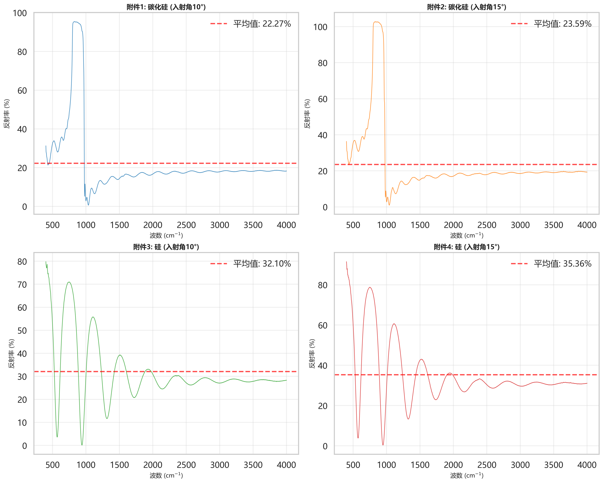

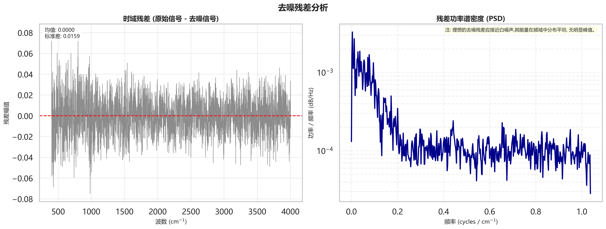

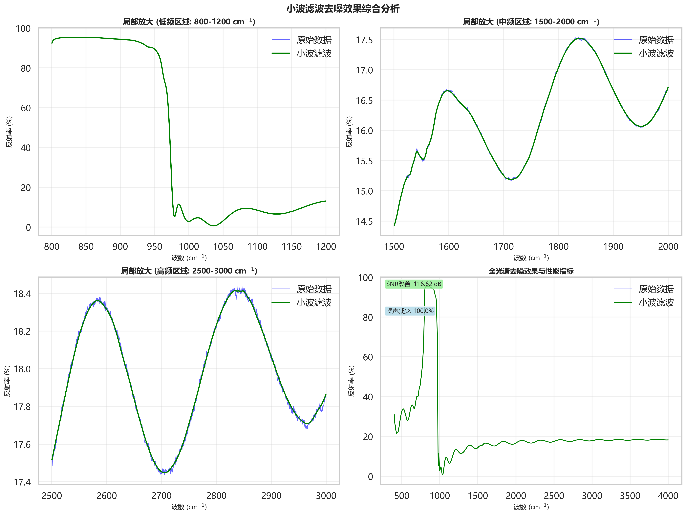

</div>

#### 3️⃣ 问题二：极值点拟合算法

基于极值点的迭代优化算法（适用于问题1和问题2）：

```bash
# 附件1（10°入射角，生成可视化图表）
python iterative_extremum_fitter.py data/附件1.csv --angle 10 --material sic --plot

# 附件2（15°入射角）
python iterative_extremum_fitter.py data/附件2.csv --angle 15 --material sic
```

**输出文件**：
- `spectrum_extrema.png` - 光谱与极值点图
- `residuals_vs_index.png` - 残差随样本索引分布图
- `residuals_hist.png` - 干涉级数残差直方图
- `refractive_index.png` - 拟合折射率n与k曲线图
- `n_surface.png` - 折射率实部随波数与载流子浓度的表面可视化图
- `interference_orders.png` - 干涉级数拟合结果图
- `de_history.png` - 差分进化优化历史与参数轨迹图
- `combined_summary.png` - 拟合摘要综合图

**示例结果**：

<div align="center">

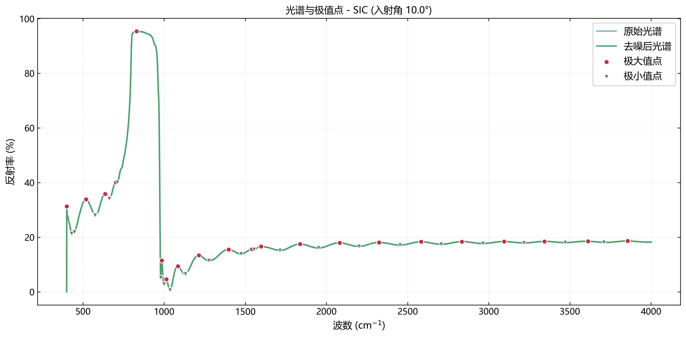

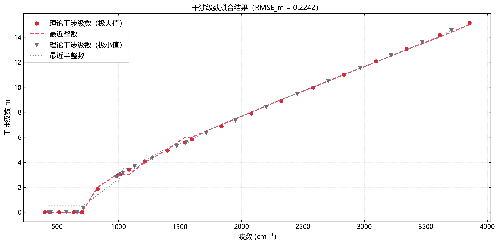

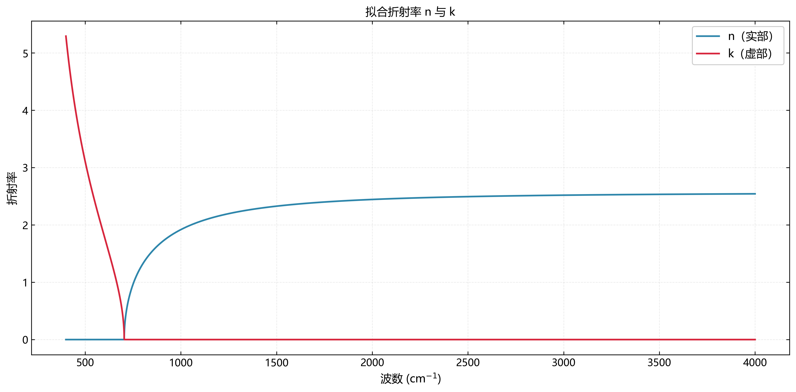

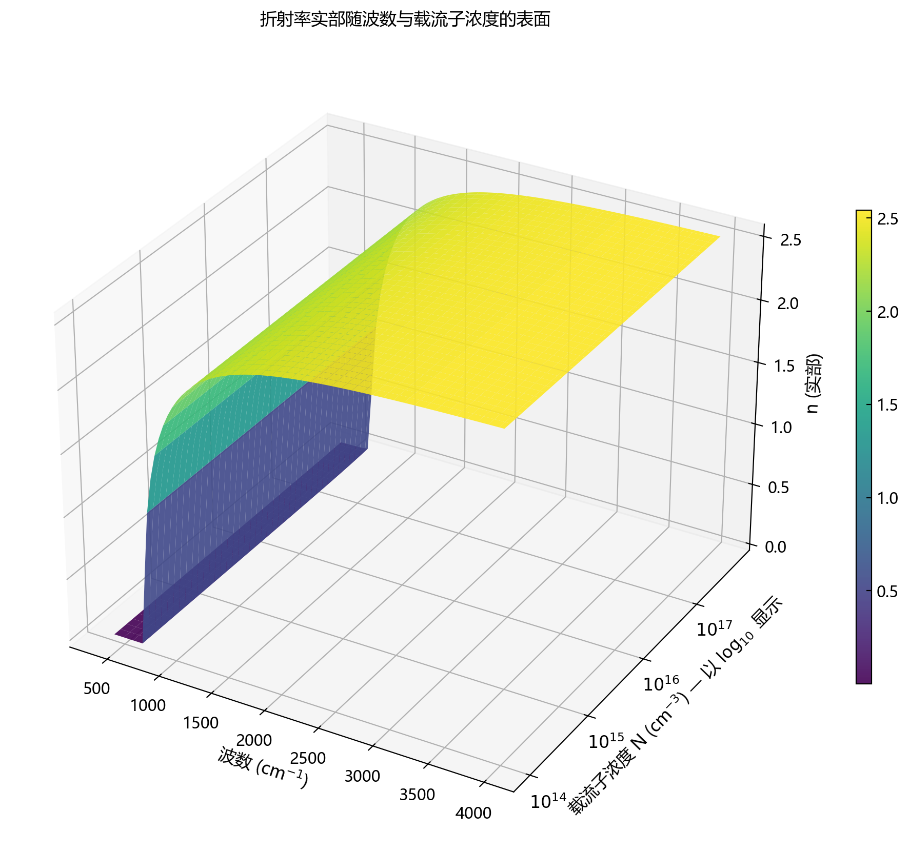

</div>

多角度测量一致性分析：
```bash
python run_multi_angle_analysis.py
```

#### 4️⃣ 问题三：全谱拟合算法

基于传输矩阵法的全谱拟合（考虑多光束干涉）：

```bash
# 硅数据
python full_spectrum_thickness.py data/附件3.csv --angle 10 --material si --method global --plot
python full_spectrum_thickness.py data/附件4.csv --angle 15 --material si --method global --plot

# 碳化硅数据
python full_spectrum_thickness.py data/附件1.csv --angle 10 --material sic --method global --plot
python full_spectrum_thickness.py data/附件2.csv --angle 15 --material sic --method global --plot
```

**输出文件**：
- `data/figures/附件*_fit_summary.png` - 全谱拟合结果综合图

**示例结果**：

<div align="center">

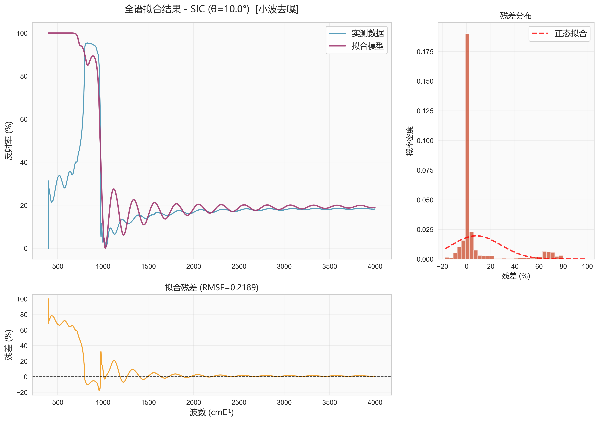
*附件1（碳化硅，10°入射角）全谱拟合结果*

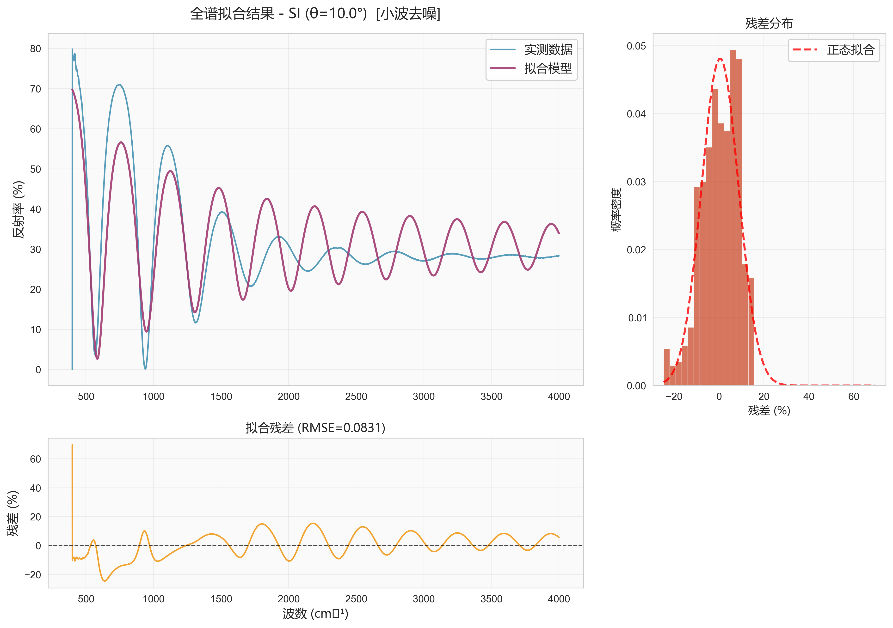
*附件3（硅，10°入射角）全谱拟合结果*

</div>

## 🔬 算法原理

### 问题一：数学模型

#### 单次反射模型

当红外光以入射角 $\theta_0$ 入射到外延层时，发生单次反射和透射（如图1所示）。两束反射光的光程差为：

$$\Delta = 2d\sqrt{n_2(\nu)^2 - \sin^2\theta_0}$$

其中：
- $d$ - 外延层厚度
- $n_2(\nu)$ - 外延层折射率（波数 $\nu$ 的函数）
- $\theta_0$ - 入射角

#### 干涉级数

定义干涉级数 $m(\nu)$ 为：

$$m(\nu) = \frac{\Delta}{\lambda} = 2d\nu\sqrt{n_2(\nu)^2 - \sin^2\theta_0}$$

干涉条件：
- **极大值点**：$m(\nu_{\text{peak}}) = k$（整数）
- **极小值点**：$m(\nu_{\text{valley}}) = k + 0.5$（半整数）

#### 折射率模型（Drude-Sellmeier）

考虑色散和载流子效应，折射率由复数介电函数决定：

$$\epsilon(\nu) = \epsilon_{\text{bound}}(\nu) + \epsilon_{\text{Drude}}(\nu)$$

- **Sellmeier项**（束缚电子）：
  $$\epsilon_{\text{bound}}(\lambda) = 1 + \sum_j \frac{B_j\lambda^2}{\lambda^2 - C_j}$$

- **Drude项**（自由载流子）：
  $$\epsilon_{\text{Drude}}(\omega) = -\frac{\omega_p^2}{\omega^2 + i\gamma\omega}$$

其中 $\omega_p^2 = \frac{Ne^2}{\epsilon_0 m_{\text{eff}}}$，$N$ 为载流子浓度，$\gamma$ 为散射率。

### 问题二：极值点拟合算法

**核心思想**：通过优化算法寻找参数组合 $\{d, N, \gamma\}$，使得所有极值点的干涉级数最接近（半）整数。

**算法流程**：
1. 📊 **数据预处理**：小波去噪
2. 🔍 **极值点提取**：使用峰值检测算法
3. 🎯 **目标函数**：最小化干涉级数残差平方和
4. 🔄 **全局优化**：差分进化算法（Differential Evolution）
5. 📈 **可靠性评估**：参数不确定度分析

### 问题三：全谱拟合算法

**核心思想**：使用传输矩阵法（TMM）计算理论反射光谱，通过全谱拟合同时确定厚度和材料参数。

**多光束干涉条件**：
当外延层与衬底界面的反射率足够高时，会发生多次反射和透射，形成多光束干涉。这要求：
- 外延层与衬底的折射率差异足够大
- 外延层厚度与波长的比值适中
- 材料吸收系数较小

**优势**：
- ✅ 利用所有数据点，信息利用率高
- ✅ 自然包含多光束干涉效应
- ✅ 同时反演外延层和衬底参数
- ✅ 对噪声更稳健

**传输矩阵法**：
对于单层薄膜系统（空气/外延层/衬底），总反射率为：

$$R_{\text{theory}}(\nu) = \left|\frac{\eta_0 - Y}{\eta_0 + Y}\right|^2$$

其中 $Y$ 为系统的等效光学导纳，由传输矩阵计算得到。

## 📊 计算结果

### 问题二：碳化硅外延层厚度（极值点拟合）

| 附件  | 入射角 | 厚度 (μm) | 不确定度 (μm) | CV    | 可靠性 |
| ----- | ------ | --------- | ------------- | ----- | ------ |
| 附件1 | 10°    | 7.746     | ±0.036        | 0.47% | 高 ✅   |
| 附件2 | 15°    | 7.646     | ±0.031        | 0.41% | 高 ✅   |

**最终推荐值**：$d = 7.688 \pm 0.024\,\mu\text{m}$（加权平均）

### 问题三：全谱拟合结果

#### 硅外延层（附件3、4）
- 附件3（10°）：$d = 7.313 \pm 0.056\,\mu\text{m}$
- 附件4（15°）：$d = 7.272 \pm 0.063\,\mu\text{m}$

#### 碳化硅外延层
- 附件1（10°）：$d = 7.257 \pm 0.087\,\mu\text{m}$
- 附件2（15°）：$d = 5.038 \pm 0.035\,\mu\text{m}$

**全谱拟合结果对比**：

| 附件  | 材料 | 入射角 | 极值点拟合 (μm) | 全谱拟合 (μm) | 差异  |
| ----- | ---- | ------ | --------------- | ------------- | ----- |
| 附件1 | SiC  | 10°    | 7.746 ± 0.036   | 7.257 ± 0.087 | 6.3%  |
| 附件2 | SiC  | 15°    | 7.646 ± 0.031   | 5.038 ± 0.035 | 34.1% |
| 附件3 | Si   | 10°    | -               | 7.313 ± 0.056 | -     |
| 附件4 | Si   | 15°    | -               | 7.272 ± 0.063 | -     |

> **注**：全谱拟合考虑了多光束干涉效应，对于硅材料（附件3、4）必须使用全谱拟合；对于碳化硅材料，两种方法的结果差异可能反映了多光束干涉的影响。同时，优化算法需要预设合理的参数边界，且该边界对拟合结果的影响较大，受比赛时间限制影响，可能未能将参数调至最优。

## 📝 使用注意事项

1. ⚠️ **数据路径**：确保数据文件位于 `data/` 目录下
2. ⚠️ **字体支持**：Windows系统自动检测中文字体，Linux/Mac可能需要配置
3. ⚠️ **计算时间**：全谱拟合算法计算量较大，可能需要几分钟

## 🙏 致谢

衷心感谢指导老师的悉心指点😊，感谢队友们在比赛期间的并肩作战💪，让本次参赛圆满结束！

## 📧 联系方式

如有任何问题或建议，欢迎通过Issue提出，也可以发送邮件至 [lxywasd@gmail.com](mailto:lxywasd@gmail.com) 与我联系。

---

**⭐ 如果这个项目对您有帮助，请给个Star支持一下~ ⭐**
